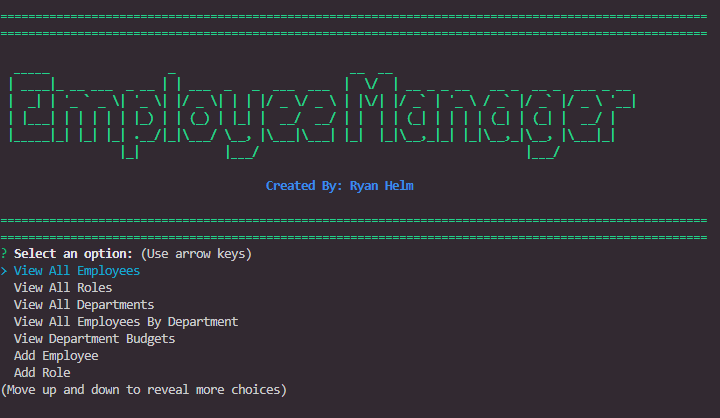

<h1 align="center">Employee Management Node.js App</h1>
  

    
    
    
    

  

    
    
    
    
    
    

   
## Description

  
The full walkthrough can be seen => [here](https://drive.google.com/file/d/16OvzQPotNFJ6Cu0C4zENIHEApXCj-WjC/view)  
  
## Installation

- `npm init`
- `npm install inquirer`
- `npm install mysql2`
- `npm install console-table`
- `npm install figlet`
- `npm install chalk`
- `npm install nodemon`
- `npm install validator`
  
## Usage
Use the Command Line after installing node dependencies to track and manage employee's within your company.
Use:

`npm start`
`node server.js`

## Contributing
GitHub: [Ryan Helm](https://github.com/rjhelm)

## Questions
Contact me with any questions: [email](mailto:ryjhelm@outlook.com) , [GitHub](https://github.com/rjhelm) 